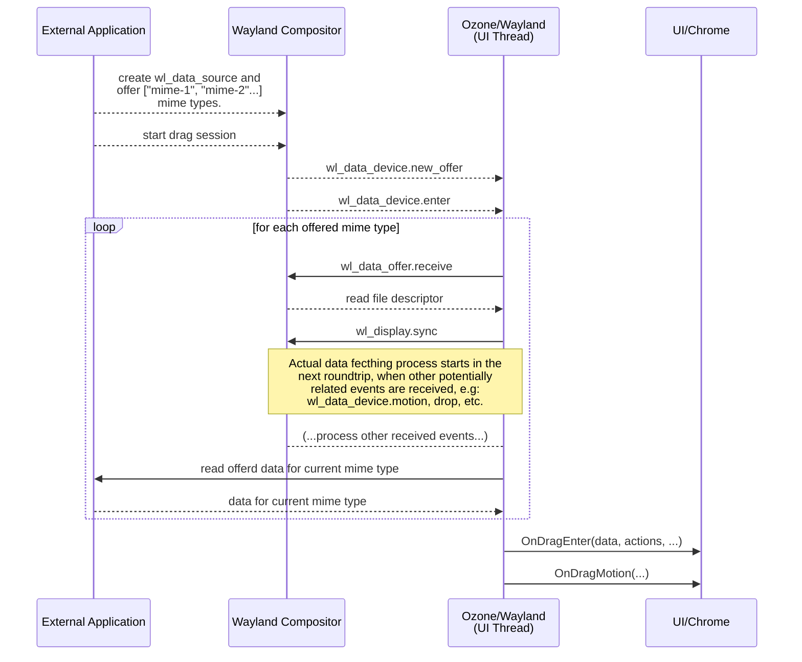
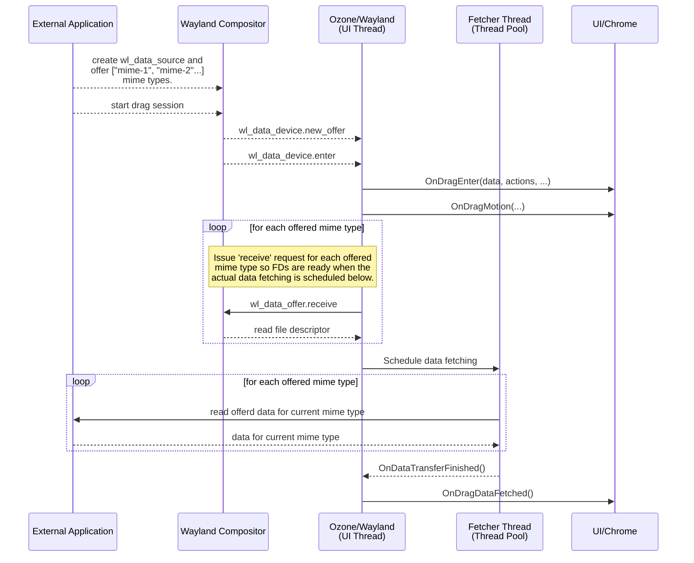

Reduce data fetching latency in incoming wayland dnd sessions
===

## The problem

> Tracking Bug: https://bugs.chromium.org/p/chromium/issues/detail?id=1487784

In data drag and drop sessions originating from external applications (eg: files app, etc), the dragged data is currently fetched sequentially using multiple`wl_display.sync` callbacks, one for each offered mime type, i.e: it is done asynchronously though in a serialized fashion. Thus, full data fetching may and usually takes several protocol roundtrips, which is sub-optimal and unnecessary.

Furthermore, the DragEnter event is only propagated to higher level layers once that whole processes finishes, which incurs in some side effects including:

- The possibility of missing legitimate drop due to inconsistent state. Eg: quick drops missed while data fetching is still unfinished. A possible real instance of this is issue 1472682.

- Subtle crashes on edge cases related to deferred enter, drop, cancel events. Which include (but are likely not limited to) issue 1487387 and issue 1400872.

This document provides a deeper analysis of the problem and proposes a solution to address the problems here explained.

### Current implementation

 As depicted above, at ozone/wayland, the process starts with `WaylandDataDragController` calls corresponding to a `wl_data_device.{new_offer,enter}` pair of events and then, for each offered mime type it sets up a `wl_display.sync` callback which will (1) create the pipe FDs for the reading operation and issue a `wl_data_offer.receive` request as well as (2) do the actual data read for that mime type. All those steps run in the Browser process' main thread (aka UI thread), and only after it's done, the `WmDropHandler`'s `OnDrag{Enter,Motion}` pair of callbacks get fired, marking the actual beginning of Chromium's drag-and-drop session.

## Proposed solution

**Status:** WIP

Chosen approach summary:
> Offload data fetching to a separate thread and decouple "data fetched" event from OnDragEnter.

- Instead of postponing "drag enter" event to when data for all offered mime types get fetched, fire it right away
- Schedule data fetching to be done asynchronously and fire a separate event to communicate a "fetch progress"
- Offload the fetching operation to a separate thread, i.e: ThreadPool, as advised in the [Threading Docs](https://chromium.googlesource.com/chromium/src/+/main/docs/threading_and_tasks.md#keeping-the-browser-responsive)

The updated sequence diagram below illustrates what is explained above.

### Tasks breakdown:

- [x] Modify DataDragController to fetch data in a separate thread [[CL](https://chromium-review.googlesource.com/c/chromium/src/+/5039167)]
- [x] Update ozone unit tests expectations [[CL](https://chromium-review.googlesource.com/c/chromium/src/+/5039167)]
- [ ] Add new "OnDragDataFetched()" callback to WmDropHandler \[WIP\]
- [ ] Update DesktopDragDropClientOzone to handle new/modified callbacks
- [ ] Update views/iui_tests tests (if needed)

## ~~Alternative approach: Make data fetching fully synchronous/blocking and call it from OnDragEnter~~

**Status:** Discontinued

- PoC CL at: https://chromium-review.googlesource.com/c/chromium/src/+/4909530
- Seems to work fine. Only tested on linux-desktop Gnome Shell 40.0 and ash+lacros-on-linux
- **Rationale**: As of now, perf-wise data drag controller already reads the data in the main thread, using wl_display.sync callbacks to 'sequentially' (slowly) fetch data for each mime type, as described in the crbug, though deferring events to after full data is fetched, which may take several roundtrips. Such approach also leads to lots of edge cases due to the 2 distinct code paths intriscic to the deferred events propagation vs constant flow of protocol events/requests.
- Pros:
  - Make code much simpler and easier to read
  - No edge cases related to event deferring, state tracking and caching, etc
  - Much more unlikely to miss a drag session start. Takes 0 wayland roundtrips.
  - Not much worse perf as blocking read in the main thread was already being done
- Cons:
  - Synchronous fd reading in main thread is usually undersirable (even though it is currently already used for clipboard, due to its current synchronous higher level API).
  - Security concerns. E.g: In theory, a malicious client may get chrome UI fully stalled by feeding a large enough data through dnd pipe.
  
# Possible follow-ups

- Improve WmDropHandler API
  - Use const ref for OSExchangeData params and give ownership of it to Ozone Platform
  - Pass it only in OnDragEnter (OnDragDrop is passed always as null atm, for example)
- Improve state tracking on WaylandDataDragController
  - Track data flow mode in the state, eg: have a enum Mode { kIncoming, kOutcoming } or add states for kStartedOutcoming and kStartedIncoming instead of only kStarted (currently not used in incoming sessions)
  

# Appendix: In-depth analysis

- How did we reach the current state?
  - Current design/impl dates from ozone/wayland early days 2018/2019, which already had a similar approach for data fetching at ozone/wayland level and mostly unchanged WmDropHandler API at aura/views level. See CLs [1176891](https://chromium-review.googlesource.com/c/chromium/src/+/1176891) and [1353040](https://chromium-review.googlesource.com/c/chromium/src/+/1353040). The difference was that instead of postponing 'enter' event propagation to when the data was fetched, it used to trigger the data fetching on 'drop' event, null was passed in as OSExchangeData on when calling OnDragEnter.
  - In Nov/2020, aiming to address a [web drag-and-drop issue](https://bugs.chromium.org/p/chromium/issues/detail?id=1147413), the data fetching was (correctly) moved to wl_data_device.enter instead, which pretty much matches the current state. After that, null OSExchangeData started to be passed in to WmDropController::OnDragDrop.
- Question: Is it possible to propagate WmDropHandler::OnDragEnter() with the info available at that point (ie: offered mime types and dnd operations) and then fetch the actual data for "in the background" and provide it to aura::DragDropClient impl when possible?
  - After analysing current design, answer is no. More details:
      - How does WmDragDrop callbacks deal with the OSExchangeData sent by platform layer?
        - Regarding the data, it basically clone and forward it to drag_drop_delegate, if any. See [UpdateTargetAndCreateDropEvent()](https://source.chromium.org/chromium/chromium/src/+/main:ui/views/widget/desktop_aura/desktop_drag_drop_client_ozone.cc;l=334-370;drc=f5bdc89c7395ed24f1b8d196a3bdd6232d5bf771)
      - How does DragDropDelegate impls, mainly [WebContentsViewAura](https://source.chromium.org/chromium/chromium/src/+/main:content/browser/web_contents/web_contents_view_aura.h;l=58;drc=f5bdc89c7395ed24f1b8d196a3bdd6232d5bf771) deal with the OSExchangeData sent by platform layer?
        - Unfortunately it does not work with "partial" (meta)data, eg: mime types available, in that case it would basically recognize it as "empty" data. See [PrepareDropData()](https://source.chromium.org/chromium/chromium/src/+/main:content/browser/web_contents/web_contents_view_aura.cc;l=699-784;drc=f5bdc89c7395ed24f1b8d196a3bdd6232d5bf771)
      - Revisit HTML/JS DnD API/spec
        - Seems unneeded for now.
      - Does it repro with other dnd web apps other than 'Gmail compose'? Does Gmail compose use any specific feature that was broken in Ozone/Wayland?
        - Seems unneeded for now.
  - Thus, the simplest option is to do the data fetching synchronous and faster but keep triggering it in WaylandDataDragController::OnDragEnter.
    
