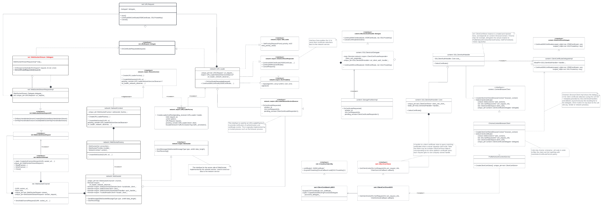

### The problem:

> - Would it be possible to implement the same logic used for HTTPS when _AutoSelectCertificateForUrls_ policy is enabled? Which wouldn’t result in an UI pop-up. 
> Context: https://bugs.chromium.org/p/chromium/issues/detail?id=993907#c26

- Main classes involved:




- For regular http/https request, [network::URLLoader]() is used. Which encapsulates a bunch of things, including the IPC interaction with NetworkService (that tipically lives in a separate process), which ultimately uses a [net::URLRequest](https://source.chromium.org/chromium/chromium/src/+/main:net/url_request/url_request.h;l=85;drc=256182eb99a7e9de19375dc250df8b3d79e0bda8) to drive the connection, as well as SSL auth/certificate handling delegated to browser process (see [network::mojom::URLLoaderNetworkServiceObserver](https://source.chromium.org/chromium/chromium/src/+/main:services/network/public/mojom/url_loader_network_service_observer.mojom;l=83;drc=169c6cc102b39295a5bfe2f2a176b42b1c2fe2c4) in the class diagram) through mojo endpoints, etc. OTOH, [WebSocketStream]() holds a URLRequest instance itself instead, which implies in a significant divergence with the HTTP path.

##### Findings and work items:

- [x] Is [ClientCertStoreNSS](https://source.chromium.org/chromium/chromium/src/+/main:net/ssl/client_cert_store_nss.h;l=23;drc=70b0ee470bd53a63da6c4194579e8c2865db2b79) the [net::ClientCertStore](https://source.chromium.org/chromium/chromium/src/+/main:net/ssl/client_cert_store.h;l=21;drc=70b0ee470bd53a63da6c4194579e8c2865db2b79) used on Linux Desktop?
  - Answer: Yes. In Chrome, created at [ProfileNetworkContextService::CreateClientCertStore](https://source.chromium.org/chromium/chromium/src/+/main:chrome/browser/net/profile_network_context_service.cc;l=622-625;drc=169c6cc102b39295a5bfe2f2a176b42b1c2fe2c4) function.
- [x] Which [network::mojom::URLLoaderNetworkServiceObserver]() impl is used for HTTPS?
  - Answer: [content::StoragePartitionImpl](https://source.chromium.org/chromium/chromium/src/+/main:content/browser/storage_partition_impl.cc;l=1853;drc=70b0ee470bd53a63da6c4194579e8c2865db2b79).
  - Steps to hit the relevant code paths:
    1. Install `badssl.com-client.p12` cert from https://badssl.com/download:
    ```sh=bash
    # Install it (tested on Arch Linux)
    pk12util -i ~/Downloads/badssl.com-client.p12 -d sql:$HOME/.pki/nssdb
    
    # To list all the certificates installed:
    certutil -d sql:$HOME/.pki/nssdb -L
    ```
    2. Load it in chrome:
    ```sh=bash
    out/linux/chrome \
      --enable-logging=stderr \
      --no-sandbox \
      --user-data-dir=/tmp/chr_tmp_linux \
      --vmodule='net/ssl/*=10,wayland*=10' \
      --ozone-platform=wayland \
      https://client.badssl.com
    ```
    3. This is the stack trace of its construction call (at browser process):
    ```c++
    [1201823:1201823:0622/203057.913491:ERROR:profile_network_context_service.cc(619)] ### Creating ClientCertStoreNSS instance.
    #0 0x7f0392475689 base::debug::CollectStackTrace()
    #1 0x7f0392361733 base::debug::StackTrace::StackTrace()
    #2 0x55896a03202d ProfileNetworkContextService::CreateClientCertStore()
    #3 0x7f038f6cbefe content::StoragePartitionImpl::OnCertificateRequested()
    #4 0x7f038ecbbd5b network::mojom::URLLoaderNetworkServiceObserverStubDispatch::Accept()
    #5 0x7f0391c72365 mojo::InterfaceEndpointClient::HandleValidatedMessage()
    ...
    #15 0x7f0391c17db0 mojo::SimpleWatcher::OnHandleReady()
    #16 0x7f0391c182d2 base::internal::Invoker<>::RunOnce()
    #17 0x7f03923fe769 base::TaskAnnotator::RunTaskImpl()
    #18 0x7f039242675a base::sequence_manager::internal::ThreadControllerWithMessagePumpImpl::DoWorkImpl()
    #19 0x7f0392425c8e base::sequence_manager::internal::ThreadControllerWithMessagePumpImpl::DoWork()
    #20 0x7f0392426f42 base::sequence_manager::internal::ThreadControllerWithMessagePumpImpl::DoWork()
    #21 0x7f0392390c83 base::MessagePumpGlib::Run()
    #22 0x7f0392427414 base::sequence_manager::internal::ThreadControllerWithMessagePumpImpl::Run()
    #23 0x7f03923cbb90 base::RunLoop::Run()
    #24 0x7f038f02d235 content::BrowserMainLoop::RunMainMessageLoop()
    #25 0x7f038f02ee92 content::BrowserMainRunnerImpl::Run()
    #26 0x7f038f02a6fb content::BrowserMain()
    #27 0x7f038fc46d15 content::RunBrowserProcessMain()
    #28 0x7f038fc486bb content::ContentMainRunnerImpl::RunBrowser()
    #29 0x7f038fc48142 content::ContentMainRunnerImpl::Run()
    #30 0x7f038fc45627 content::RunContentProcess()
    #31 0x7f038fc45702 content::ContentMain()
    #32 0x5589691a7533 ChromeMain
    #33 0x7f037f5fb310 __libc_start_call_main
    #34 0x7f037f5fb3c1 __libc_start_main_alias_2
    #35 0x5589691a732a _start

    ```
- [x] Which process/thread [WebSocketStream::Delegate::OnCertificateRequested()](https://source.chromium.org/chromium/chromium/src/+/main:net/websockets/websocket_stream.cc;l=426;drc=0e45c020c43b1a9f6d2870ff7f92b30a2f03a458) runs in?
  - Answer: It runs in NetworkService process, in the io thread.
  - Here is a sample stack trace of [net::WebSocketStreamRequestImpl::PerformUpgrade()]():
      ```
      #2 0x7fe46e6b6194 net::(anonymous namespace)::WebSocketStreamRequestImpl::PerformUpgrade()
      #3 0x7fe46e6b5af7 net::(anonymous namespace)::Delegate::OnResponseStarted()
      #4 0x7fe46e62a691 net::URLRequest::NotifyResponseStarted()
      #5 0x7fe46e63b26d net::URLRequestJob::NotifyFinalHeadersReceived()
      #6 0x7fe46e63aa3d net::URLRequestJob::NotifyHeadersComplete()
      #7 0x7fe46e633260 net::URLRequestHttpJob::NotifyHeadersComplete()
      #8 0x7fe46e635c55 net::URLRequestHttpJob::SaveCookiesAndNotifyHeadersComplete()
      #9 0x7fe46e6343ee net::URLRequestHttpJob::OnStartCompleted()
      #10 0x7fe46e4de32c net::HttpCache::Transaction::DoLoop()
      #11 0x7fe46e3e34fa base::internal::Invoker<>::RunOnce()
      #12 0x7fe46e4fbde0 net::HttpNetworkTransaction::DoCallback()
      #13 0x7fe46e69c305 net::WebSocketBasicHandshakeStream::ReadResponseHeadersCallback()
      #14 0x7fe46e4d23ad base::internal::Invoker<>::RunOnce()
      #15 0x7fe46e530923 net::HttpStreamParser::OnIOComplete()
      #16 0x7fe46e3e34fa base::internal::Invoker<>::RunOnce()
      #17 0x7fe46e5cd078 net::TCPClientSocket::DidCompleteRead()
      #18 0x7fe46e6770df net::TCPSocketPosix::ReadCompleted()
      #19 0x7fe46e67887a base::internal::Invoker<>::RunOnce()
      #20 0x7fe46e674e52 net::SocketPosix::RetryRead()
      #21 0x7fe46e675b15 net::SocketPosix::ReadCompleted()
      #22 0x7fe46e675904 net::SocketPosix::OnFileCanReadWithoutBlocking()
      #23 0x7fe47045e6c9 base::MessagePumpLibevent::OnLibeventNotification()
      #24 0x7fe47052be6c event_base_loop
      #25 0x7fe47045e9b1 base::MessagePumpLibevent::Run()
      #26 0x7fe4703c6414 base::sequence_manager::internal::ThreadControllerWithMessagePumpImpl::Run()
      #27 0x7fe47036ab90 base::RunLoop::Run()
      #28 0x7fe4703f5e6c base::Thread::Run()
      #29 0x7fe46cb14580 content::(anonymous namespace)::ChildIOThread::Run()
      #30 0x7fe4703f61ee base::Thread::ThreadMain()
      #31 0x7fe47042e51b base::(anonymous namespace)::ThreadFunc()
      #32 0x7fe45d5fa5c2 start_thread
      #33 0x7fe45d67f584 __GI___clone
      ```
- [ ] Would it be possible manipulate [net::ClientCertStore]() (same used in URLLoader path, though in browser process instead) straight away from [net::WebSocketStream]() code? That would simplify things in case of a more short-term approach(/workaround), eg: No mojo to communicate with browser process, no migration to URLLoader, etc.
